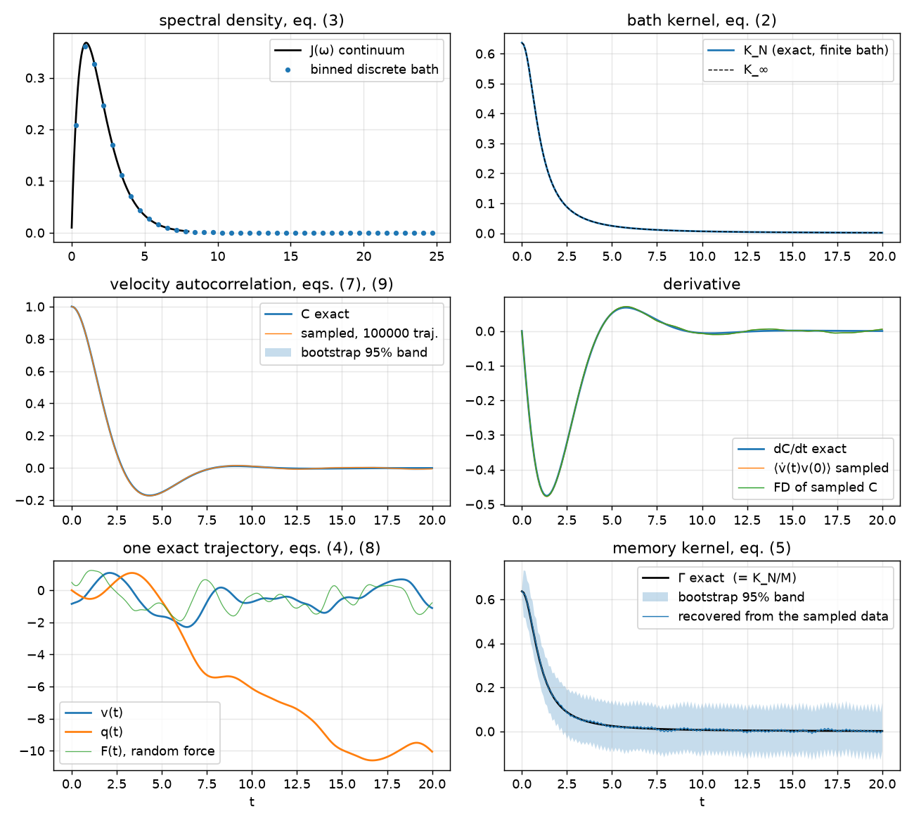

# kac-zwanzig

[](https://github.com/william-pfalzgraff/kac-zwanzig/actions/workflows/ci.yml)
[](https://pypi.org/project/kac-zwanzig/)
[](LICENSE)

An exactly solvable Kac–Zwanzig bath: memory kernels, correlation functions and
trajectories in closed form, plus sampled correlation functions with the statistical
noise of a real simulation. 

The Kac–Zwanzig model is a single particle attached by springs to a collection of
harmonic oscillators, the "bath". It is a simple model of a solute jostled by a 
liquid: the oscillators take energy from the particle and hand it back later, and 
that delayed response is the memory effect that shapes the particle's velocity 
autocorrelation function (VACF) in molecular dynamics (MD) simulations of liquids. 
Because every force in the model is linear, it can be solved exactly. The particle's 
correlation functions, the memory kernel of its generalized Langevin equation (GLE), 
and even individual trajectories are all available in closed form, up to one matrix 
diagonalization. 

`kac_zwanzig` generates, for a bath you choose:

- the spectral density and its discretization into oscillators,
- the exact memory kernel of the finite bath and its continuum limit,
- the exact VACF `C(t)` and its time derivative,
- exact trajectories of the particle: velocity, acceleration, position and the GLE's random force,
- sampled VACFs from `n` independent trajectories, with the noise a simulation would have,
  standard errors and a bootstrap,
- a bundle of `C`, `dC/dt` and the exact kernel to feed to any kernel-extraction method.

It depends only on numpy and contains no solver.

## Theory

**The Hamiltonian.** A particle of mass `M`, coordinate `q`, momentum `p`, optionally in a
harmonic trap of frequency `Ω` (zero by default), coupled to `N` oscillators with
coordinates `x_j`, frequencies `ω_j` and coupling weights `k_j ≥ 0`:

$$
H=\frac{p^2}{2M}+\frac{1}{2}M\Omega^2q^2+\sum_{j=1}^{N}\left[\frac{p_j^2}{2}+\frac{\omega_j^2}{2}\Big(x_j-\frac{\sqrt{k_j}}{\omega_j}\,q\Big)^2\right]. \tag{1}
$$

**The bath kernel and the spectral density.** The bath acts on the particle through one
function only,

$$
K_N(t)=\sum_{j=1}^{N}k_j\cos\omega_j t, \tag{2}
$$

which is exact for the finite bath. A continuous bath is described by a spectral density
`J(ω)`; the two are related by

$$
J(\omega)=\frac{\pi}{2}\sum_j k_j\,\omega_j\,\delta(\omega-\omega_j),\qquad
K_\infty(t)=\frac{2}{\pi}\int_0^\infty\frac{J(\omega)}{\omega}\cos\omega t\,d\omega, \tag{3}
$$

so choosing `(ω_j, k_j)` is choosing a quadrature rule for the cosine transform in (3).

**The generalized Langevin equation.** Integrating out the oscillators exactly gives, for
the particle's velocity `v = p/M`,

$$
M\,\dot v(t)=-M\Omega^2 q(t)-\int_0^t K_N(t-s)\,v(s)\,ds+F(t), \tag{4}
$$

where `F(t)` is the *random force*, a function of the oscillators' initial conditions
only. When those initial conditions are drawn from the canonical (thermal) ensemble,
`⟨F(t) F(0)⟩ = k_BT K_N(t)` (the fluctuation–dissipation theorem) and `⟨F(t) v(0)⟩ = 0`.

**The memory kernel of the correlation function.** Multiplying (4) by `v(0)` and averaging
turns it into an equation for the normalized VACF `C(t) = ⟨v(t)v(0)⟩/⟨v²⟩`:

$$
\dot C(t)=-\int_0^t\Gamma(t-s)\,C(s)\,ds,\qquad \Gamma(t)=\frac{K_N(t)+M\Omega^2}{M}. \tag{5}
$$

`Γ` is the memory kernel (the bath kernel per unit mass, plus the trap). Equation (5) 
holds identically for every finite bath, so `Γ` is the exact reference no matter how 
the bath was discretized.

**Normal modes.** The coupled system is a set of `N+1` independent oscillators. Their
frequencies `ν_k` are the square roots of the eigenvalues of an `(N+1)×(N+1)` arrowhead
matrix, and each mode carries a share `a_k²` of the particle (`Σ_k a_k² = 1`). The
nonzero frequencies solve

$$
\sum_{j=1}^{N}\frac{k_j}{\nu^2-\omega_j^2}=M, \tag{6}
$$

one root between each pair of neighbouring `ω_j²` and one above the last. A free particle
also has one zero-frequency mode, the rigid translation of everything together.

**The exact correlation function.** In normal modes the VACF is a finite cosine series:

$$
C(t)=\sum_k a_k^2\cos\nu_k t,\qquad \dot C(t)=-\sum_k a_k^2\,\nu_k\sin\nu_k t. \tag{7}
$$

**Exact trajectories.** Thermal initial conditions are independent Gaussians in the
normal modes, so a trajectory of the particle is

$$
v(t)=\sum_k\big[\alpha_k\cos\nu_k t+\beta_k\sin\nu_k t\big],\qquad
\alpha_k,\beta_k\sim\mathcal N\!\left(0,\;\frac{a_k^2\,k_BT}{M}\right), \tag{8}
$$

with the acceleration `dv/dt` and the position `q(t) = q(0) + ∫v` obtained term by term
and the random force `F(t)` of (4) reconstructed from the oscillators' initial
coordinates. No time step is involved: any output grid, no integration error.

**Sampled correlation functions.** A "simulation" is an average over `n` independent
trajectories,

$$
\hat C(t)=\frac{\sum_{n}v_n(t)\,v_n(0)}{\sum_{n}v_n(0)^2},\qquad
\mathrm{Var}\big[\hat C(t)\big]=\frac{1-C(t)^2}{n},\qquad
\mathrm{Cov}\big[\hat C(t),\hat C(t')\big]=\frac{C(t-t')-C(t)C(t')}{n}, \tag{9}
$$

because `v(t)` is a Gaussian process. The noise is correlated in time on the scale of
`C` itself, which matters when `Ĉ` is differentiated or inverted. The derivative can also
be estimated without differencing, from `⟨v̇(t) v(0)⟩`, since the acceleration is known
along every trajectory (as the forces are in MD).

**The two preset baths.**

$$
\text{Ohmic: }J(\omega)=\eta\,\omega\,e^{-\omega/\omega_c},\quad K_\infty(t)=\frac{2\eta\omega_c/\pi}{1+\omega_c^2t^2};\qquad
\text{Debye: }J(\omega)=\frac{2\lambda\omega_c\,\omega}{\omega_c^2+\omega^2},\quad K_\infty(t)=2\lambda\,e^{-\omega_c t}. \tag{10}
$$

For a free particle in the Ohmic bath the shape of `C(t)` depends on one number only,
`η/(Mω_c)`; `ω_c` sets the unit of time. With `M = ω_c = 1`, `η = 1` gives the single shallow
negative dip typical of liquids.

The derivations are in [docs/theory.md](docs/theory.md); the choice of frequency grid is
analysed in [docs/frequency_grids.pdf](docs/frequency_grids.pdf).

## Install

```bash
pip install kac-zwanzig
```

Only numpy is required. For the examples add matplotlib (`pip install "kac-zwanzig[examples]"`).
From a checkout: `pip install -e ".[dev]"` and `python -m pytest -q` (about 30 tests, under a minute).

## Quick start

```python
import numpy as np
import kac_zwanzig as kz

bath = kz.ohmic(eta=1.0, omega_c=1.0, N=2000)      # J(ω) of eq. (10), discretized into 2000 oscillators
s = kz.System(bath, M=1.0, kT=1.0)                  # the particle of eq. (1), free (Omega = 0)
t = np.arange(0, 20, 0.05)

K_N   = bath.kernel(t)                              # eq. (2)
K_oo  = bath.kernel_continuum(t)                    # eq. (3), closed form for the presets
C     = s.vacf(t)                                   # eq. (7)
Cdot  = s.vacf_dot(t)
Gamma = s.memory_kernel(t)                          # eq. (5): the answer a kernel-extraction method should find

traj = s.trajectory(t, n_traj=1, seed=0, random_force=True)   # eq. (8): traj.v, traj.a, traj.q, traj.F
est  = s.sampled_vacf(t, n_traj=10_000, seed=1)     # eq. (9): est.C, est.Cdot_acc, est.stderr()
boot = est.bootstrap(1000)                          # replicate curves: boot.std(), boot.band()

data = s.inversion_data(t, est, derivative="acc")  # C, dC/dt and the exact Γ, bundled for your solver
# Gamma_solved = my_solver(data.C, data.Cdot, data.dt)      solves eq. (5)
# data.residual(Gamma_solved)                               max error against the exact Γ
```

[examples/quickstart.py](examples/quickstart.py) runs this end to end, recovers the kernel with
the deliberately simple solver in [examples/naive_inversion.py](examples/naive_inversion.py),
and makes the figure below; [examples/quickstart.ipynb](examples/quickstart.ipynb) is the
same as an executed notebook.



## Worked examples

**Which discretization?** Two grids are built in. `grid="uniform"` places oscillators at
equally spaced frequencies up to a cutoff and weights them by `J(ω)/ω`; it is a midpoint
rule for the integral in (3), its error is a smooth, tiny copy of the kernel shifted to
`t = 2π/Δω`, and it is the default for the Ohmic bath. `grid="invcdf"` places the
oscillators at quantiles of `J(ω)/ω` with equal weights; it never truncates and gets
`K(0)` exactly but leaves a small high-frequency ripple in `K_N`. Either way `K_N` and `Γ`
are the exact answers for the bath you built; the grid only decides how closely the
finite bath imitates the continuum. [examples/frequency_grids.py](examples/frequency_grids.py)
makes the comparison figures; the PDF in `docs/` has the analysis.

```python
b1 = kz.ohmic(eta=1.0, N=2000)                      # uniform grid: |K_N - K_oo| ~ 4e-6 for t < 250
b2 = kz.ohmic(eta=1.0, N=2000, grid="invcdf")       # equal-weight quantile grid: ripple ~ 2e-3
b3 = kz.Bath.from_spectral_density(lambda w: 0.5*w**3*np.exp(-w), N=1000, omega_max=30)   # any J(ω)
```

**One trajectory and the GLE.** Equation (4) holds exactly along every trajectory; the
residual of the discretized convolution is a direct check of the whole machinery.

```python
tr = s.trajectory(np.arange(0, 5, 0.002), n_traj=3, seed=0, random_force=True)
res = kz.gle_residual(s, tr)        # M dv/dt + int K_N v - F, zero up to the trapezoid error
```

**Sampled VACF with error bars.** `sampled_vacf` splits the trajectories into
independent groups (50 by default), keeps a complete estimate per group, and reports the
pooled estimate. The group spread gives a standard error at each time; resampling groups
with replacement gives bootstrap replicates that keep the time correlation of (9) and
handle the ratio normalization exactly. Use the replicates to put error bars on anything
computed from `Ĉ`, such as a recovered kernel.
[examples/sampling_noise.py](examples/sampling_noise.py) studies the noise, the derivative
estimators and why averaging one long trajectory over time does not work for this model.

```python
est  = s.sampled_vacf(t, n_traj=100_000, seed=1)       # noise ~ sqrt((1 - C^2)/1e5) ~ 3e-3
se   = est.stderr()                                     # standard error from the group spread
boot = est.bootstrap(n_boot=1000, seed=2)
lo, hi = boot.band("C", level=0.95)                     # pointwise 95% band
sig  = np.sqrt(kz.predicted_variance(C, 100_000))       # what eq. (9) predicts, for comparison
```

## API

Everything below is available as `kz.<name>` after `import kac_zwanzig as kz`.

### Baths (`kac_zwanzig.bath`)

| Call | Returns |
|---|---|
| `kz.ohmic(eta, omega_c, N=2000, grid="uniform", omega_max=25ω_c)` | `Bath`, eq. (10) Ohmic; friction `η`, `K(0) = 2ηω_c/π` |
| `kz.debye(lmbda, omega_c, N=2000, grid="invcdf", omega_max=100ω_c)` | `Bath`, eq. (10) Debye; `K(0) = 2λ` |
| `kz.Bath.from_spectral_density(J, N, grid, omega_max)` | `Bath` from any callable `J(ω)` (numerical quantiles and continuum kernel) |
| `kz.Bath(omega, k)` | `Bath` from arrays `ω_j`, `k_j` |
| `bath.kernel(t)` | exact `K_N(t)`, eq. (2); also `kernel_dot`, `kernel_integral` |
| `bath.kernel_continuum(t)` | `K_∞(t)`, eq. (3) |
| `bath.J(omega)` | continuum spectral density |
| `bath.spectral_density_histogram(bins)` | the discrete `J` binned, for plotting |
| `bath.K0`, `bath.N`, `bath.omega`, `bath.k`, `bath.describe()` | |
| `kz.debye_vacf_continuum(t, lmbda, omega_c, M)` | closed-form continuum VACF for the Debye bath |

### Particle + bath (`kac_zwanzig.system`)

| Call | Returns |
|---|---|
| `kz.System(bath, M=1, kT=1, Omega=0)` | the particle of eq. (1) |
| `s.vacf(t)`, `s.vacf_dot(t)`, `s.vacf_ddot(t)` | exact `C`, `dC/dt`, `d²C/dt²`, eq. (7), on any grid |
| `s.memory_kernel(t)`, `s.memory_kernel_0` | exact `Γ(t)` of eq. (5) and `Γ(0)` |
| `s.memory_kernel_continuum(t)` | its `N → ∞` limit, for orientation |
| `s.spectral_measure()` → `nu, a2` | mode frequencies and particle weights, eq. (6) |
| `s.eigenvectors()` | full eigenvector matrix (needed only for the random force) |
| `s.trajectory(t, n_traj=1, seed=None, positions=True, random_force=False)` | `Trajectory` with `v, a, q, F` of shape `(n_traj, len(t))`, eq. (8) |
| `s.sampled_vacf(t, n_traj, seed=None, normalization="sample", n_blocks=50)` | `VACFEstimate`, eq. (9) |
| `s.inversion_data(t, estimate=None, derivative="acc")` | `InversionData`: `.C, .Cdot, .dt, .memory_kernel, .memory_kernel_0, .residual(Γ)` |

### Sampling, propagation, estimators (`kac_zwanzig.sample`, `.propagate`, `.estimate`)

| Call | Returns |
|---|---|
| `kz.sample_modes(s, n_traj, rng)` → `alpha, beta` | thermal initial conditions as the amplitudes of eq. (8), `(N+1, n_traj)` |
| `kz.sample_state(s, n_traj, rng)` → `ModeState` | the full mode state `(P, Q)` plus `alpha, beta`; needed for the random force |
| `kz.velocity(s, t, alpha, beta)`, `kz.acceleration(...)`, `kz.position(..., q0=0)` | `(n_traj, len(t))` arrays, exact |
| `kz.random_force(s, t, state)`, `kz.initial_position(s, state)` | `F(t)` of eq. (4) and the sampled `q(0)` |
| `kz.gle_residual(s, traj)` | `M dv/dt + MΩ²q + ∫K_N v − F` on the trajectory grid |
| `kz.vacf_ensemble(s, t, n_traj, rng, normalization, n_blocks)` | `VACFEstimate` (same as `s.sampled_vacf`) |
| `est.C`, `est.Cdot_acc`, `est.Cdot_sym` | pooled estimate; `⟨v̇(t)v(0)⟩` derivative; its symmetrized version |
| `est.stderr(which="C")` | standard error from the spread of the groups |
| `est.bootstrap(n_boot, seed)` → `BootstrapResult` | replicate curves `.C, .Cdot_acc, .Cdot_sym` with `.std()`, `.band(level)`, `.covariance()` |
| `est.blocks_C`, `est.blocks_R`, `est.block_sizes` | per-group normalized and raw estimates |
| `kz.vacf_direct(s, t, alpha, beta)` | reference estimator that forms the trajectories explicitly |
| `kz.finite_difference(C, dt, order=2)` | `dC/dt` by central differences, using `C(−t) = C(t)` at the origin |
| `kz.predicted_variance(C, n_traj, normalization)`, `kz.predicted_covariance(...)` | eq. (9) (and the `(1 + C²)/n` form for exact normalization) |
| `kz.vacf_time_average(v, n_lags)`, `kz.time_average_floor(s, t)` | single-trajectory time average and its (non-vanishing) error floor |

## Conventions and things to know

- **Normalization.** `C(0) = 1`. Sampled estimates divide by the sampled `⟨v(0)²⟩` by default
  (`normalization="sample"`, eq. (9)); `"exact"` divides by `k_BT/M` instead and has noise
  `(1 + C²)/n`. The memory kernel does not depend on either choice.
- **Sign of the kernel.** The package reports `Γ` as defined in (5), positive at `t = 0`. A
  solver that writes (5) with a plus sign wants `−Γ` and `−Γ(0)` as its initial value.
- **Groups, not time blocks.** The "blocks" in `sampled_vacf` are groups of independent
  trajectories, used for standard errors and the bootstrap. They are not the block
  averaging of MD time series; trajectories here are independent by construction.
- **Ensemble, not time, averages.** The finite bath is integrable: averaging one long
  trajectory over time origins stalls at an error floor set by `1/Σ_k a_k⁴` effective modes
  and never converges to the thermal `C(t)`. `sampled_vacf` averages over independent
  initial conditions, which does converge (`kz.vacf_time_average` exists to demonstrate the trap).
- **Derivatives.** `est.Cdot_acc` uses the acceleration along each trajectory, so it has no
  differencing error; `kz.finite_difference` is the alternative. Because the noise in (9) is
  smooth in time, differencing amplifies it far less than white noise would.
- **Cost.** The eigensolve takes about a second at `N = 2000` and scales as `N³`. `sampled_vacf`
  never forms the trajectory array (`O(N (n_traj + len(t)))`; `10⁶` trajectories in about 30 s).
  `trajectory` does form it, `n_traj × len(t)` doubles, and the random force additionally needs
  the `(N+1)²` eigenvector matrix (32 MB at `N = 2000`).
- **What it is not.** No anharmonic potentials (the particle is free or harmonically trapped),
  no thermostat or integrator (nothing to integrate), no quantum effects, no time-averaged
  observables (see above), and no solver.

## Repository layout

| Path | Contents |
|---|---|
| `src/kac_zwanzig/` | the package: `bath`, `system`, `sample`, `propagate`, `estimate` |
| `tests/` | test suite (`python -m pytest -q`) |
| `examples/` | `quickstart.py` and its executed notebook, `naive_inversion.py`, `frequency_grids.py`, `sampling_noise.py`, `orientation.py` |
| `docs/` | `theory.md` (derivations), `frequency_grids.pdf` (grid analysis), the README figure |
| `CITATION.cff`, `CHANGELOG.md`, `RELEASING.md` | citation metadata, release notes, how releases are made |

## Citing

If this package is useful in your work, please cite it: GitHub's "Cite this repository"
button (from `CITATION.cff`) gives BibTeX and APA entries.

## License

MIT, see [LICENSE](LICENSE).
